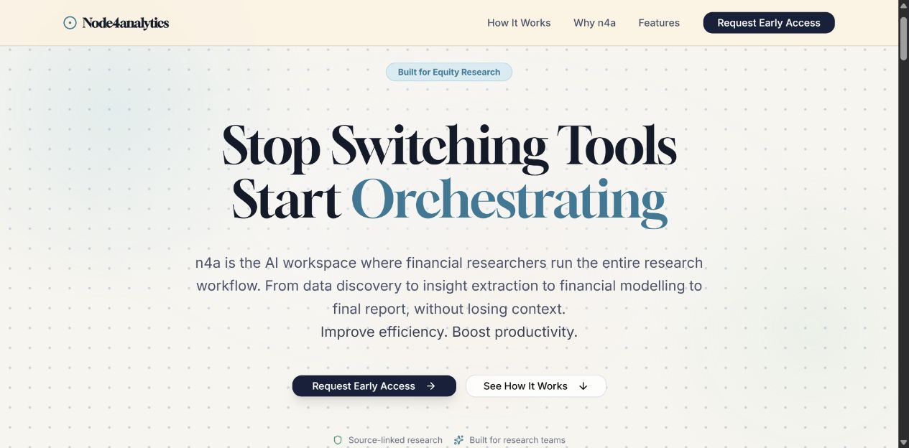

# Node4analytics

**Live site:** [node4analytics.com](https://www.node4analytics.com/)

**An AI research workspace concept for equity analysts: connect sources, preserve context, and turn evidence into a reasoned investment view.**

This repository brings together the Node4analytics landing page, an interactive workflow concept, and the research behind the product. The focus is the analyst's journey from scattered filings and spreadsheets to connected analysis with traceable sources.



## Explore the project

| Start here | What you will find |
| --- | --- |
| [Run the landing page](#run-locally) | Product positioning, a draggable workflow canvas, feature walkthroughs, and a contact action |
| [Research and insights](docs/RESEARCH-INSIGHTS.md) | The problem, design choices, supporting evidence, and open validation questions |
| [Product requirements](docs/prd.md) | Intended workflows, requirements, success metrics, and risks |
| [Documentation guide](docs/README.md) | A curated route through competitive research, design, and technical thinking |
| [Workflow concept](Financial%20Workflow%20Canvas.html) | An early standalone canvas experiment; download and open it in a browser |

## The problem

Equity research spans company filings, earnings calls, news, financial models, notes, and reports. Each tool holds part of the evidence; moving between them can lose the context connecting a number, its source, and the analyst's reasoning.

Node4analytics explores a workspace where evidence stays attached as it moves through the workflow. AI supports reading and synthesis, while the analyst owns the interpretation and investment judgment.

The broader product design has six connected surfaces: **Library** for evidence and company understanding, **Graph** for relationships, **Canvas** for research workflows, **Dashboard** for conviction and decisions, **Notes** for the research journal, and **Connectors** for sources and tools. Their rationale is documented here; the executable app in this repository is the landing page.

## What works here

- Responsive landing page with desktop and mobile navigation.
- Interactive canvas preview with draggable nodes, connected edges, expandable panels, spreadsheet-style information, and a document preview.
- Motion effects that respond to the operating system's reduced-motion preference.
- An email link to request a walkthrough; no form service or signup account is required.
- Optional PostHog analytics, disabled when no project key is configured.

**The canvas is an illustrative interaction preview.** Its financial figures, messages, and report content are sample UI content; it does not fetch market data, call a model, ingest files, or save a research workspace. The standalone HTML is also a concept demonstration. Neither should be used as financial evidence.

Architecture documents describe the broader research platform. A Python AI service, database, ingestion pipeline, and their historical evaluation suites are not included in this repository. Historical test counts are records of that work, not checks reproduced by this landing page.

## Run locally

Use **Node.js 22 LTS** and npm. Next.js requires Node.js 20.9 or later.

```bash
cd frontend
npm ci
npm run dev
```

Open [localhost:3000](http://localhost:3000). No environment file, database, or API key is needed. Dependency installation and the first build require internet access; Next.js downloads the Google Fonts used by the page.

For a production check, stop the development server first:

```bash
npm run check
npm run build
npm start
```

`check` runs ESLint and TypeScript. There is no unit-test suite in this landing page; [the verification guide](docs/VERIFY.md) covers the observable interactions. The frontend workflow runs these static checks and a production build on GitHub.

To explore the early standalone workflow, open `Financial Workflow Canvas.html` directly in a modern desktop browser. It loads React, Babel, and fonts from external CDNs, so it requires internet access and has no build step.

## Repository layout

```text
frontend/                   Next.js landing page and interactive preview
docs/RESEARCH-INSIGHTS.md    Research synthesis and product decisions
docs/Competitor research/   Ten dated product and design teardowns
docs/prototype-update/      Analyst research, case studies, and review records
docs/reference/             Broader platform architecture and research references
DESIGN-SYSTEM.md            Workspace design reference
Financial Workflow Canvas.html
                            Early standalone interaction concept
```

Read the [documentation guide](docs/README.md) for the scope and date of each record. Some research uses the earlier working name **FinQuira**; the current public name is **Node4analytics**, abbreviated **n4a**.

## Deployment and configuration

For a Next.js host, set the project root to `frontend`, install with `npm ci`, and build with `npm run build`. This page needs no backend service. See [frontend/README.md](frontend/README.md) for optional analytics configuration.

## Sources and authorship

Research notes link to the papers, company disclosures, and product pages they draw from. Company financial documents and third-party reports are not bundled for redistribution. The research library distinguishes primary sources, vendor claims, practitioner commentary, and design hypotheses; planned efficiency targets are not measured customer outcomes.

Created by **Chinmay Marathe**. Contact: [cmarathe1@gmail.com](mailto:cmarathe1@gmail.com).
