# N4A — System Diagrams & Process Guide

> **Repository scope · 2026-10-07:** This is a broader-product research or historical development record. Features, commands, evaluation counts, prices, and status below retain their original context; they are not verification of the landing page included here. Some referenced services, ADRs, source PDFs, and prototypes are not distributed in this repository. See the [documentation guide](../README.md) for current scope.

> **status:** reference · **authoritative for:** the runtime *flows* — what happens, in what order, in
> which process, and where AI actually runs · **last verified against code:** 2026-09-25 (the
> new-company slice: door 4 and the isolated parse, ADR 0131–0135).
>
> Visual + plain-language companion to [`ARCHITECTURE.md`](ARCHITECTURE.md). That file owns the
> **contracts**; this one owns the **flows**. Every diagram names the real modules beside it — when a
> flow changes, redraw it in the same change.
>
> **Every diagram here is parser-verified.** The 2026-07-27 rewrite replaced an edition frozen at
> 2026-07-03 that predated the entire Library rework: it described chunks as cut from pages, claims as
> a flat table, extraction as one call per sentence-sized "atomic fact", and a connection layer that
> no longer exists — and one of its 14 diagrams had never rendered at all.

**Who this is for:** you already know *what* N4A is (`AGENTS.md`) — this is *how the machinery works*,
and which file to open to see it for yourself.

## Contents

1. [The one-paragraph mental model](#1-the-one-paragraph-mental-model)
2. [Architecture](#2-architecture)
3. [The four storage layers](#3-the-four-storage-layers)
4. [End-to-end: upload → ready](#4-end-to-end-upload--ready)
5. [The run substrate — the load-bearing idea](#5-the-run-substrate--the-load-bearing-idea)
6. [A document's life: honest stage states](#6-a-documents-life-honest-stage-states)
7. [Prose → decision-grade propositions](#7-prose--decision-grade-propositions)
8. [The business-model connection layer](#8-the-business-model-connection-layer)
9. [Assembling and rendering the graph](#9-assembling-and-rendering-the-graph)
10. [Ask N4A](#10-ask-n4a)
11. [The three trust axes](#11-the-three-trust-axes)
12. [Why a cell is empty — the evidence-state resolver](#12-why-a-cell-is-empty--the-evidence-state-resolver)
13. [Opening a citation — the address, and what a mark RESTS ON](#13-opening-a-citation--the-address-and-what-a-mark-rests-on)
14. [Where AI actually runs](#14-where-ai-actually-runs)
15. [What's built vs. deferred](#15-whats-built-vs-deferred)
16. [File map](#16-file-map)

---

## 1. The one-paragraph mental model

An analyst drops in a PDF — an annual report, a concall transcript, a broker note. Parse turns it into
**typed elements** (headings, paragraphs, tables, transcript turns), and **chunks are views over those
elements**, never a character window; the page survives as the *provenance anchor* every citation
resolves down to. A **coverage planner** decides which evidence bundles are worth an LLM call and
records what it skipped, so the system can say what it missed. Extraction writes **immutable
mentions** — kept *and* rejected, with reasons — and every layer below them is a **rebuildable
derivation** that can be swapped atomically without a single provider call. Propositions carry who
said it, about whom, for which Indian fiscal period, on what basis; a **deterministic comparator**
decides whether two of them are even comparable, then shows both cited sides without picking a winner.
Alongside them a **connection layer** reads mandated segment disclosures with zero LLM calls and gates
prose relations twice before drawing an edge. Nothing an analyst sees is anonymous: every node, edge
and answer resolves to a real page in a real PDF.

---

## 2. Architecture

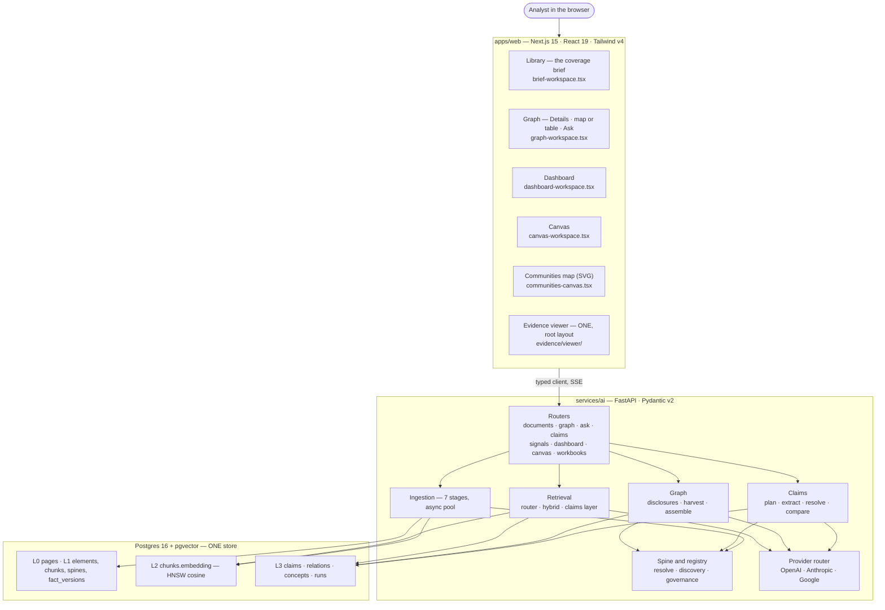

**Why the split:** the rich frontend is unarguably React/TS; PDF parsing, embeddings and LLM
extraction live in Python's ecosystem. The boundary is a typed HTTP contract, so both halves build
against `packages/contracts` rather than against each other.

---

## 3. The four storage layers

Not four stores — four layers of **one** corpus, each lower one more derived and less authoritative.

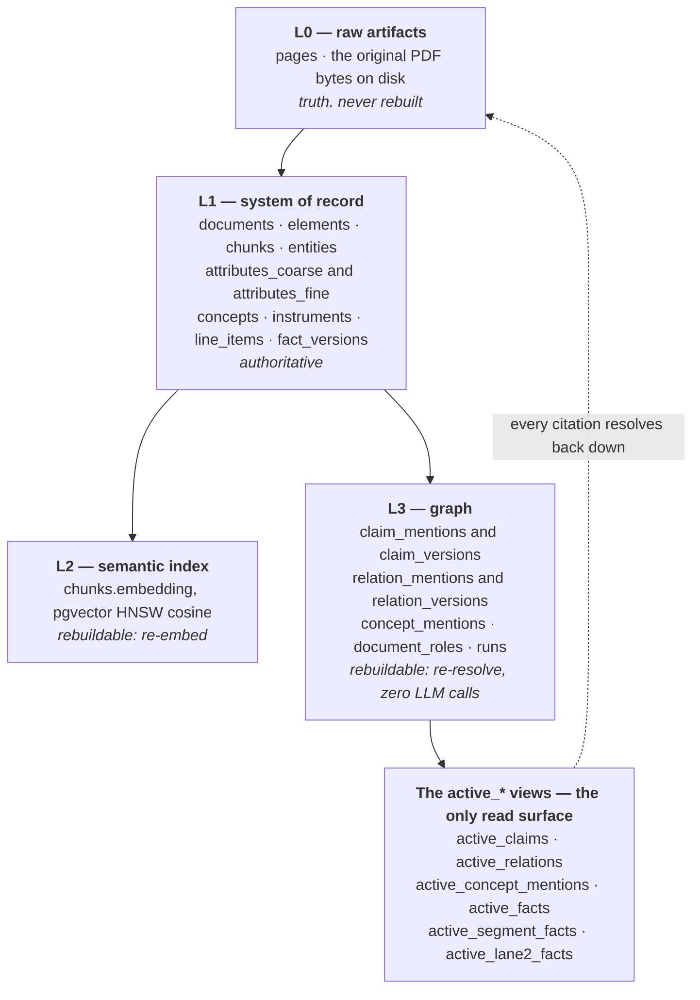

**The rule that keeps this honest — invariant #7:** vectors and the graph are *indexes over* L0/L1,
never the source of truth. Every citation resolves **down** the stack: proposition → chunk → element →
page range in the original PDF. Break that chain and the four layers silently drift.

Full physical schema — every table, every column, FK and CHECK vocabulary:
[`DATABASE-SCHEMA.html`](DATABASE-SCHEMA.html).

---

## 4. End-to-end: upload → ready

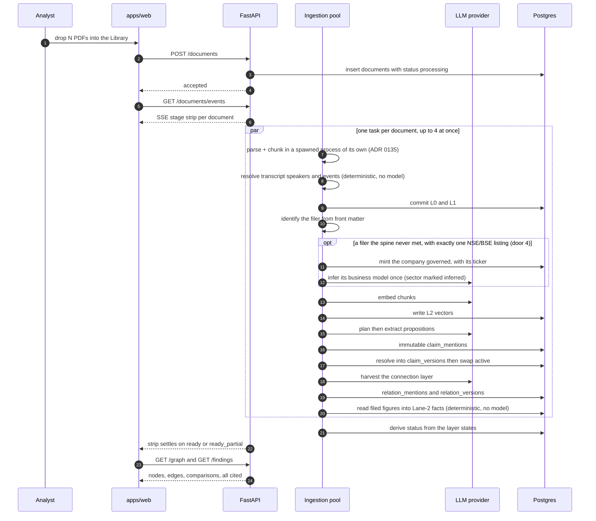

**Parallel by document, sequential within one** (`app/ingestion/parallel.py`, ADR 0026). Embedding and
extraction run concurrently per document — they read the same L1 chunks but write disjoint tables.
Harvest is its own durable stage rather than hidden inside extract, because it is the longest LLM pass
and the analyst deserves to watch it run.

**A new company is decided by the upload, not the analyst** (ADR 0131–0132, `app/company/`). Door 4
binds a filer at identify when the exchange's register vouches for exactly one listing, so
extraction already knows whose claims it reads. Only a residual filer (no or an ambiguous listing)
reaches the Library's one *New company* card via `GET /companies/pending`; `POST /companies/confirm`
then re-derives what the missing company held back — filed figures first, then a claims
re-resolve and the harvest re-anchor (`parallel.rederive_after_passport_change`). A run that
began before the company existed reloads the registry before it resolves (ADR 0132 D1).

**The parse is a process, not a thread** (`app/ingestion/isolated.py`, ADR 0135). A 400-page parse
holds the GIL for about a minute; in a thread it starved `/healthz` and every other document's
network calls. One spawned process per job keeps the service answerable, isolates a native crash to
its own document, and dies with its parent.

---

## 5. The run substrate — the load-bearing idea

The most important structural idea in the backend: **what is expensive is immutable, and what is
derived is disposable.**

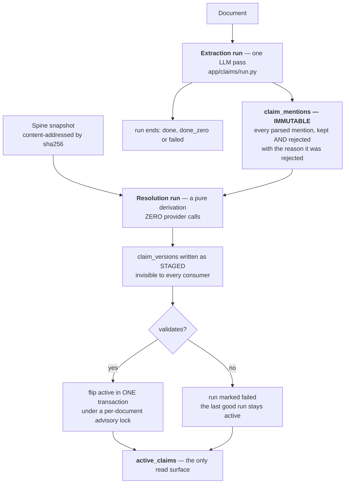

Three consequences worth internalising:

- **A staged, retired or failed run is structurally invisible.** Consumers read only the views, so a
  half-finished rerun can never leak onto the analyst's screen.
- **A partial unique index enforces one active run per (document, layer).** A structural backstop no
  writer can bypass, not a convention someone has to remember.
- **Re-resolving the entire corpus against a changed spine costs nothing but CPU.** That is what makes
  the concept registry safe to evolve: fix a definition, sweep every document, re-extract nothing.

---

## 6. A document's life: honest stage states

The vocabulary is deliberately **honest per layer** — a real zero-result is not a missing API key is
not a crash. The coarse badge is a *pure function* of the layer states (`derive_status`), so the badge
can never contradict the strip.

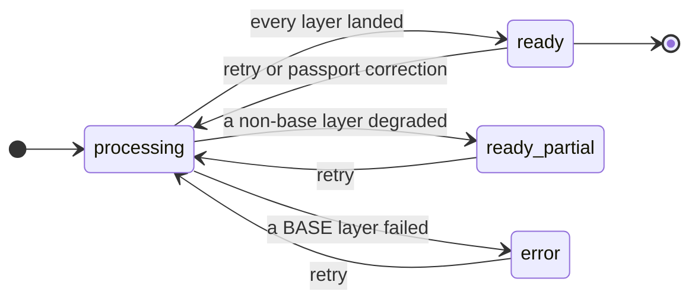

| Layer state | Means |
|---|---|
| `done` | produced output |
| `done_zero` | ran to a real conclusion and found nothing — **not** a failure |
| `skipped_no_provider` | no API key; the layer never ran |
| `failed` | attempted, broke |
| `stale` | invalidated by a passport correction or upstream retry; data still served, retry offered |
| `blocked_ocr` | image-only document — 1D detects and blocks rather than reporting clean zero text |
| `needs_review` | something useful was withheld for a human, and a clean zero would hide it. On **extract**: strict field grounding held propositions back. On **resolve** (rung 4, ADR 0077): mentions matched no live analytical role and are held for review — a document whose every mention needs a decision must never read as `done_zero` |
| `blocked_missing_details` | a secondary source needs its covered-company anchor before it may extract |

**Base layers are `parse`, `chunk`, `embed`** — without text there is no evidence, so a failure there
is a document `error`. Every layer after them degrades to `ready_partial`, never to a fake `ready`.

---

## 7. Prose → decision-grade propositions

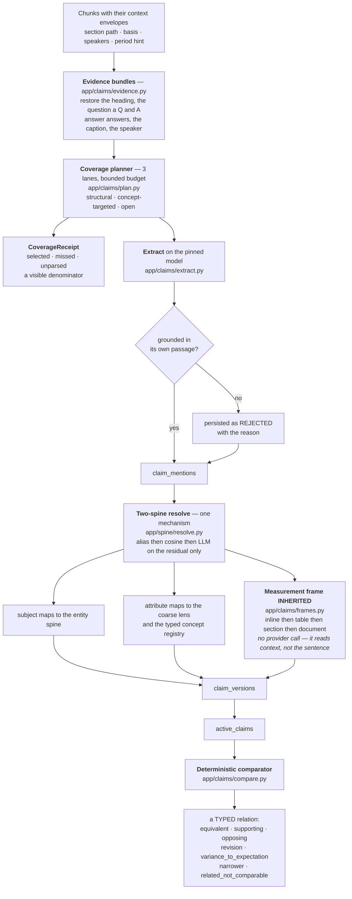

**Why precision beats recall here.** For a contestation system a fabricated claim is worse than a
missed one, so a proposition whose body is not supported by its source passage is rejected — the
extraction-time analogue of `enforceCitations()`. Rejections are *persisted with their reason*, so a
later grounding improvement can be measured against them instead of guessed at.

**Why the comparator is deterministic — invariant #9.** Two propositions are comparable only when
their frames match: subject scope, concept, referent interval, the six-dimension **measurement
frame**, comparator, modality, qualifiers. Without that, NIM on total assets "contests" NIM on
interest-earning assets, and management guidance "contests" the reported actual. A missing dimension
yields *possibly comparable, flagged* — never a silent `not_comparable`, because **an engine that
never fires looks calm while being broken.**

**Four brakes, and each says whose gap it is (ADR 0086).** A *defaulted* period is not a comparison
key (`period_assumed` — **ours**, routed to the rung-12 inbox) · a populated frame disagreement
blocks always (`frame_incompatible`) · a dimension one side states and the other does not blocks as
**asymmetry**, while symmetric silence blocks nothing (`frame_not_disclosed` — **the record's**, an
observation with **no `nextAction`**) · and a `document`-tier value may brake but never clear. The
retired `basis_unknown` conflated the first two populations into one queue of homework.

---

## 8. The business-model connection layer

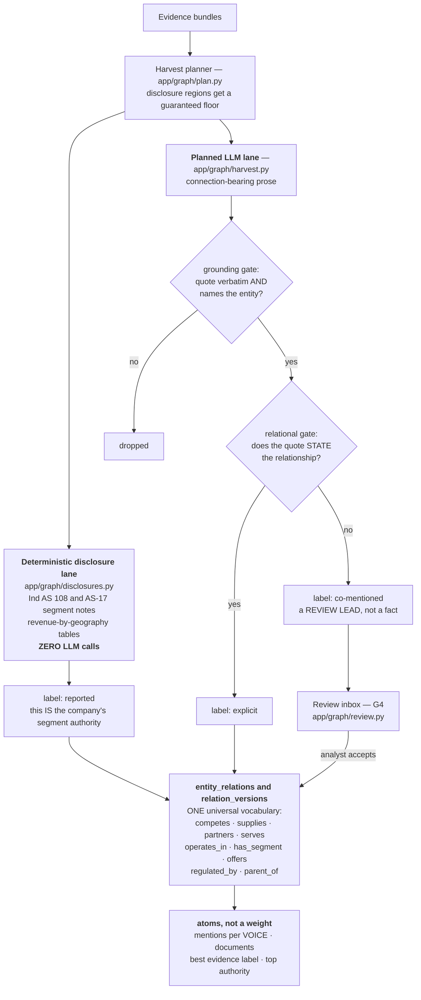

**The failure this design prevents.** A journalist's aside — *"the likes of HCLTech and TCS have been
giving us concrete numbers"* — passes the grounding gate for a `competitor` mention while asserting no
rivalry at all. Drawing that as a solid `competes` edge is precisely the fabricated relationship
invariant #1 forbids. So it stays `co-mentioned`, and **G4 gives the analyst a verb** — accept or
reject — so a review lead stops being a permanent one.

**Mentions are counted per lineage, not per document.** One issuer's annual report and investor deck
are *one voice repeating itself*, not two independent sources.

---

## 9. Assembling and rendering the graph

```mermaid
flowchart LR
    scope["<b>ResearchScope</b> — app/scope.py<br/>ONE definition of the included<br/>sources, hashed server-side"]
    scope --> assemble["app/graph/assemble.py"]

    subgraph tiers["Three-tier projection"]
        company["Company anchors"]
        theme["Theme nodes — the coarse buckets"]
        position["<b>Position nodes</b><br/>one subject-driver-period cell<br/>polarity COLLAPSED into internal Sides"]
    end

    assemble --> tiers
    conn["Connection-layer edges"] --> tiers
    tiers --> budget["<b>Materiality budget</b><br/>independent-source breadth first"]
    budget --> resp["GraphResponse<br/>nodes and edges, with atoms"]
    resp --> browser["communities-canvas.tsx"]
    browser --> sim["<b>Deterministic layout; moves in a ref, never React state</b><br/>invariant #4 · ADR 0140"]
    sim --> paint["areas ringed, none overlapping<br/>level of detail · label declutter · focus dimming"]
```

**Why Positions and not claims.** A contested driver is *one node with two opposing Sides*, not two
orphan dots that happen to disagree. Atomic claims are **evidence behind** a Position, never nodes of
their own — which is what lets the canvas read as a decision map instead of a claim dump.

**Graph assembly runs at read time and contains no LLM call at all.**

---

## 10. Ask N4A

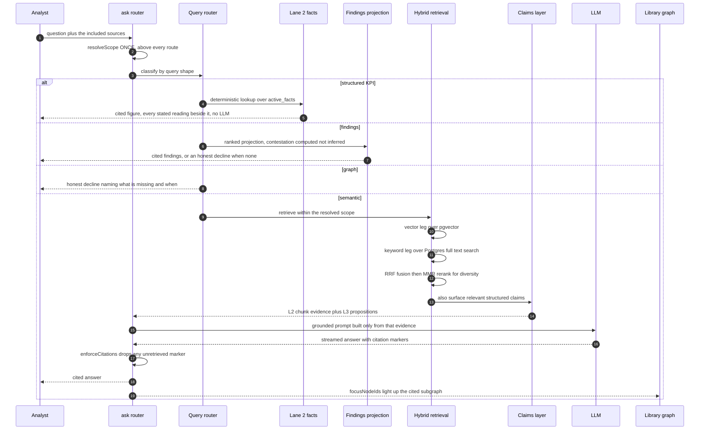

**`enforceCitations()` is non-bypassable middleware.** Any citation whose chunk was not in the
retrieved evidence is **structurally deleted** — the model cannot fabricate provenance, it can only
fail to cite. Invariant #1 implemented as a control-flow guarantee rather than a prompt instruction.

**The keyword leg earns its keep.** Pure vector search ranked a literal phrase like "operating margin"
third; the lexical leg puts it first, and RRF fuses the two rankings without anyone tuning score
scales. MMR then picks a *diverse* top-k so the context isn't three near-duplicate chunks straddling
one topic.

**Scope is resolved ONCE, above every route** (ADR 0092). `None` means no scope was given, an empty
list means the analyst switched every source off, and the two are opposite instructions — so a route
that re-derives the mode from the list's truthiness answers a deselected-everything question out of
the whole workspace. That happened twice, on two different routes, and was fixed twice at the call
site before the conversion was hoisted above all of them.

**Three of the four routes now ANSWER.** The KPI lane is live (rung 6b, ADR 0088): a numeric
question is a deterministic lookup over `active_facts` with **no LLM in the path**, cited to the
cell, and where the record states the same measurement more than once it shows every reading rather
than picking a winner (invariant #9). Findings answer from the ranked projection. **Graph still
declines**, naming what is missing and when — and a KPI *miss* still declines rather than pulling a
number out of annual-report prose, which is the rule's original point: the only "attrition" text in
the Infosys AR is an actuarial footnote.

---

## 11. The three trust axes

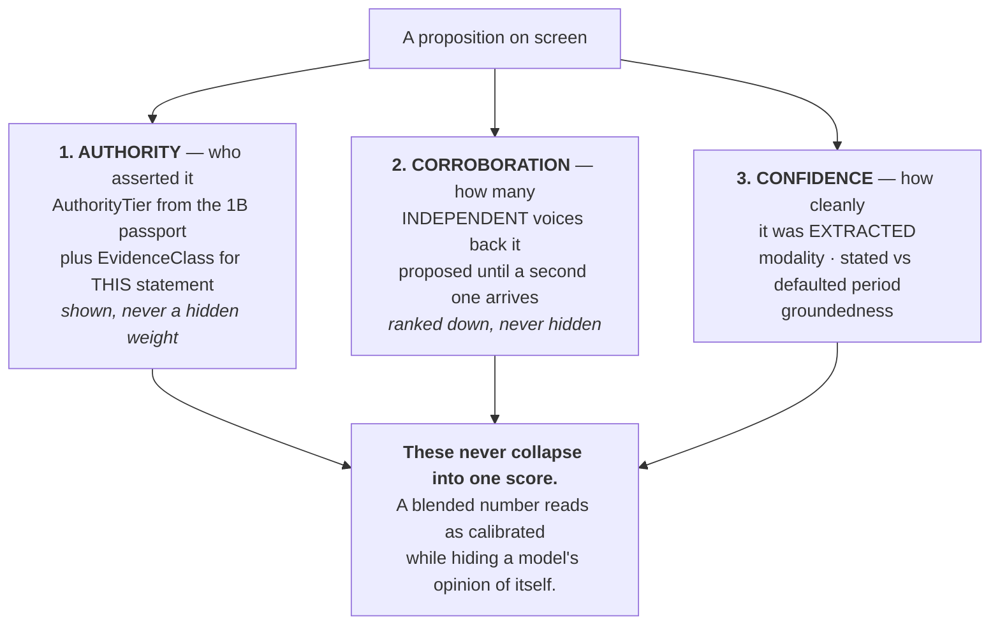

**Two authority dimensions, not one.** The passport tier says what the *artifact* is; `EvidenceClass`
says what kind of *statement* this exact cited proposition is. Without the second, an audited annual
report stamps `audited_filing` on a management guidance sentence — unaudited prose wearing an
auditor's seal. That is the **inherited-trust** family: a label earned by a coarse object being
inherited by a finer one that never earned it.

**Provenance is enforced at the schema level, not by convention.** The zod contract itself refuses to
parse a `position` node with zero citations, or a `supports`/`contradicts` edge with zero citations —
invariant #1 is a runtime-checked constraint on the wire shape.

---

## 12. Why a cell is empty — the evidence-state resolver

**Rung 7 · ADR 0064 → 0094 → 0095 → 0096 → 0097 → 0098.** For one `(subject, role, period)` triple
the reader returns the single state an interface shows. **The states are DERIVED, never stored:**
they are not mutually exclusive, so they are computed by a **recorded precedence** over six
orthogonal receipts, each of which stays individually inspectable. No second ontology (invariant 8).

The hard rule: **an absence is OURS until proven otherwise.** Extraction is open-ended, so nothing
ever asks a document whether it addresses a role — which is why the honest state is
`expected_not_found` (*expected here, our scope does not carry it* — a lead) and never
`not_disclosed` (*the record was asked and is silent* — an assertion about the issuer).

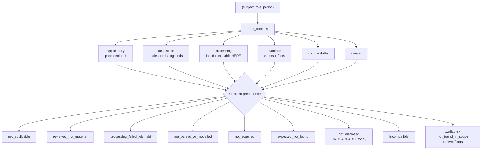

**How a mandated duty is judged** (0098). A duty is a *disclosure*, and it is judged against the
exact thing its instrument names — never against the analytical role it happens to be drawn in,
which is a bucket of a dozen disclosures. Three tiers, strongest first; the third is not a verdict.

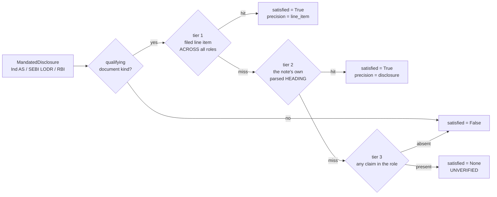

`satisfied` is **tri-state and `None` is the point**: role-level evidence means *we could not check
this at the precision the rule requires*, which folds into neither neighbour — into `True` it hides
a gap, into `False` it restates *we cannot tell* as *they did not disclose it*. Consumers read it
through `mandate_unmet` / `mandate_unverified`, one conversion above every call site.

**Code:** `app/evidence/model.py` (reference outside this repository: `../../services/ai/app/evidence/model.py`) (receipts, predicates,
`PRECEDENCE` as data) · `read.py` (reference outside this repository: `../../services/ai/app/evidence/read.py`) (the only store access) ·
`expectation.py` (reference outside this repository: `../../services/ai/app/evidence/expectation.py`) (the mandate registry — never a
company) · `headings.py` (reference outside this repository: `../../services/ai/app/evidence/headings.py`) (tier 2) ·
`leads.py` (reference outside this repository: `../../services/ai/app/evidence/leads.py`) (`coverage_gap` / `disclosure_break`).
**Instrument:** `uv run python -m app.eval.evidence_state_probe --store --grid`.

**Its DOOR is rung 8** (ADR 0099): `project.py` (reference outside this repository: `../../services/ai/app/evidence/project.py`) projects the grid, `routers/evidence.py` (reference outside this repository: `../../services/ai/app/routers/evidence.py`) serves it at `GET /evidence`, and `evidence.ts` (reference outside this repository: `../../packages/contracts/src/evidence.ts`) carries the states, their analyst-facing COPY and the receipts to the browser — so a surface renders what the contract says, never what a drawing showed. A drift test asserts the zod union equals the Python `Literal` exactly and in order; `node scripts/verify-design-system.mjs` derives all 77 of its assertions from that module.

## 13. Opening a citation — the address, and what a mark RESTS ON

**Rung 10b (ADR 0109–0111).** Every citation an analyst can see carries an `anchor: ObjectRef` and
opens onto its own evidence. There is **one** viewer, mounted once in the root layout, so a new
surface inherits it by existing rather than by remembering.

The rule the two audits bought: **a mark is an assertion, and the response must say what it rests
on.** `resolution.status` is about the ANCHOR; the highlight is frequently about something else, so
the verdict is taken against the grid the response is about to SHOW, and `highlight.basis` reports
whether the ref's own content was compared (`anchor_content`) or the mark rests on a recorded
coordinate (`recorded_position`). Neither may absorb the other.

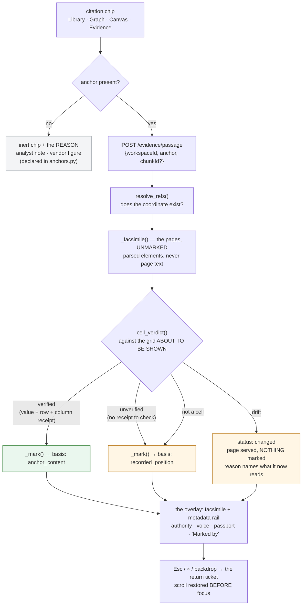

**Why each edge is the way it is.** The facsimile is `chunks.edges.elements`, not a string search of
page text — a text match fails *silently* on whitespace and hyphenation, drawing nothing over a page
that does hold the evidence. The verdict comes AFTER the fetch because resolving, verifying and
rendering in three reads at READ COMMITTED let a response verify one reading and display another
(0111). And a `changed` anchor still serves the page: an analyst whose citation drifted needs to read
and judge, not to be refused.

**Where the address comes from.** `app/provenance/anchors.py` is the ONLY place one is minted, and
its register is checked against the **syntax tree** — a register that only checked its own rows would
be a census. `app/provenance/backfill.py` filled the 65,269 citations minted before the field
existed: deterministic, no model, no parse, nothing downstream recomputed, **so no baseline expired**.

**Instruments:** `uv run python -m app.eval.citation_probe [--store] [--open-all]` (the wire and the
door) · `apps/web/app/evidence/viewer/*.test.ts` (the render decisions — a Python probe cannot render
TSX). A verify card names both halves.

## 14. Where AI actually runs

Three shapes of call, three failure postures. The tag on each node says which:

| Tag | What it is | Cost | Failure posture |
|---|---|---|---|
| `[embed]` | an embedding call (`text-embedding-3-small`) | cheap, bulk | mechanical — same text, same vector |
| `[LLM]` | a chat completion | the expensive part | precision-gated, or a bounded loop; never ends in silence |
| `[CPU]` | deterministic code, **no AI** | fast, reproducible | fails loudly — these are the guardrails |

**The `[CPU]` steps bracket the `[LLM]` steps by design.** A deterministic gate runs *before* a call to
decide whether it is worth making, and another runs *after* to throw away anything ungrounded.

### 14.1 Workflow A — ingestion (automatic, on upload)

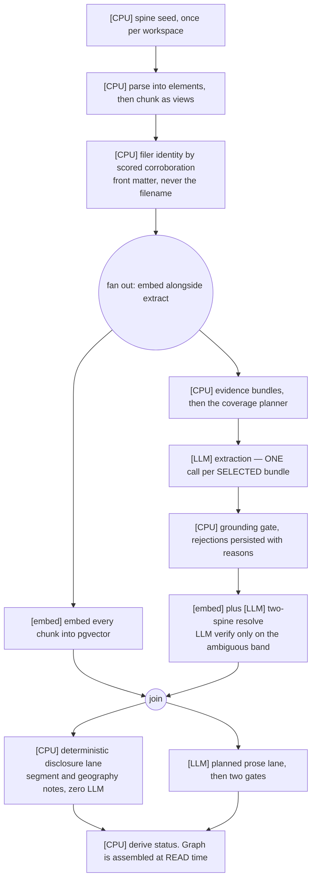

**The whole system's AI cost lives in extraction and the harvest prose lane.** Everything else is an
embedding, a once-per-document call, or low-volume and interactive. Those two fan out per selected
bundle and per passage, which is why a model or reasoning-effort change is *felt* there — in both
latency and bill — and is a rounding error everywhere else.

**Since 1F-1 the fan-out is bounded and accountable.** It used to be one call per sentence-sized atom
picked by a blind even stride over document order; it is now one call per bundle the planner selected,
with a receipt naming what it skipped.

### 14.2 Workflow B — query time (user-triggered, no fixed order between them)

| Entry point | Shape |
|---|---|
| Ask N4A | `[CPU]` classify → `[embed]` embed query → `[CPU/DB]` hybrid retrieve → `[LLM]` cited synthesis → `[CPU]` enforce citations |
| Canvas Document assistant | `[LLM]` bounded tool-calling loop, ≤ 24 iterations |
| Canvas Excel assistant | `[LLM]` bounded tool-calling loop, ≤ 18 iterations |
| Canvas one-shot generators | a single `[LLM]` call each — table generation, section rewrite |

### 14.3 Workflow C — registry growth (manual / offline)

Growing the concept registry is **not** part of upload. Ingestion only *seeds* the deterministic spine
and *reads* it during resolution. Discovery, proposal and governed mutation are operator steps
(`app.spine.cli`), each with an impact preview and a sweep receipt before anything is applied.

### 14.4 The pins and the gates

| Setting | Value | Note |
|---|---|---|
| `extraction_model` | `gpt-5.4-nano` @ `low` | one rung up on written-down live evidence |
| `document_assistant_model` / `excel_assistant_model` | `gpt-5.4-nano` | judgment-heavy, low volume |
| `default_chat_model`, `concept_discovery_model`, `resolver_verify_model` | `gpt-5-nano` | the standing default (ADR 0037) |
| `embedding_model` | `text-embedding-3-small` | |
| `ingest_max_concurrent_docs` | 4 | documents in flight |
| `llm_max_concurrency` | 10 | **the one hard provider cap** |

The rate gate (`app/llm/concurrency.py`) is a **`threading.BoundedSemaphore`**, not an
`asyncio.Semaphore` — the provider SDKs are synchronous and calls execute on worker threads, so an
asyncio semaphore could not gate them. Every provider call in the process contends on the same gate,
which is what stops N documents ingesting in parallel from collectively earning 429s.

---

## 15. What's built vs. deferred

| Area | State |
|---|---|
| Ingestion · elements · chunk views · filer identity · run substrate | **built, user-verified** |
| Concept / definition / comparability registry + governance | **built, user-verified** |
| Decision-grade propositions + deterministic comparison | **built, user-verified** |
| Business-model connection layer + G4 review | **built, user-verified** |
| Library · Dashboard S1–S3 · Canvas C1–C8 | **built, user-verified** |
| Ask — semantic route with the L3 claims leg | **built** |
| Ask — findings route (rung 5) · structured-KPI route (rung 6b) | **built, user-verified** — both ANSWER, cited |
| Ask — graph route | **declines honestly**, not built |
| Lane 2b — filed numeric facts (`fact_mentions` → `active_facts`) | **built, user-verified 2026-08-30** (ADR 0088–0093) |
| Lane 2d — SEGMENT facts (`active_segment_facts`; availability via `active_lane2_facts`) | **built, user-verified 2026-09-21** (ADR 0116, audited by 0117/0118/0119) — retires 0090's declared absence |
| Person extractor · source discovery | deferred |
| OCR lane engine | 1D **detects and blocks** only |
| Notes · Connectors surfaces · Auth.js · Dashboard S4 | deferred |
| Apache AGE / Cypher projection | installed, unused — deferred by ADR 0019 §6 |

Offline eval: `uv run python -m app.eval --offline` — 8 suites, 0 unresolved amber.

---

## 16. File map

| Flow | Open this |
|---|---|
| Stage list + honest states | `stages.py` (reference outside this repository: `../../services/ai/app/ingestion/stages.py`) |
| Parse → typed elements | `parse.py` (reference outside this repository: `../../services/ai/app/ingestion/parse.py`) · `elements.py` (reference outside this repository: `../../services/ai/app/ingestion/elements.py`) |
| Chunks as element views | `chunk.py` (reference outside this repository: `../../services/ai/app/ingestion/chunk.py`) |
| Filer identity | `filer.py` (reference outside this repository: `../../services/ai/app/ingestion/filer.py`) |
| Parallel orchestration + rate gate | `parallel.py` (reference outside this repository: `../../services/ai/app/ingestion/parallel.py`) · `concurrency.py` (reference outside this repository: `../../services/ai/app/llm/concurrency.py`) |
| Run substrate | `runs/store.py` (reference outside this repository: `../../services/ai/app/runs/store.py`) · `runs/snapshot.py` (reference outside this repository: `../../services/ai/app/runs/snapshot.py`) |
| Coverage planner + bundles | `claims/plan.py` (reference outside this repository: `../../services/ai/app/claims/plan.py`) · `claims/evidence.py` (reference outside this repository: `../../services/ai/app/claims/evidence.py`) |
| Extraction + resolution | `claims/extract.py` (reference outside this repository: `../../services/ai/app/claims/extract.py`) · `claims/resolve.py` (reference outside this repository: `../../services/ai/app/claims/resolve.py`) |
| Comparison | `claims/compare.py` (reference outside this repository: `../../services/ai/app/claims/compare.py`) |
| Concept registry + governance | `spine/registry.py` (reference outside this repository: `../../services/ai/app/spine/registry.py`) · `spine/governance.py` (reference outside this repository: `../../services/ai/app/spine/governance.py`) |
| Disclosure lane | `graph/disclosures.py` (reference outside this repository: `../../services/ai/app/graph/disclosures.py`) |
| Harvest + the two gates | `graph/harvest.py` (reference outside this repository: `../../services/ai/app/graph/harvest.py`) · `graph/relational.py` (reference outside this repository: `../../services/ai/app/graph/relational.py`) |
| Graph assembly + trust axes | `graph/assemble.py` (reference outside this repository: `../../services/ai/app/graph/assemble.py`) · `graph/trust.py` (reference outside this repository: `../../services/ai/app/graph/trust.py`) |
| Analyst review — G4 | `graph/review.py` (reference outside this repository: `../../services/ai/app/graph/review.py`) · `claims/review.py` (reference outside this repository: `../../services/ai/app/claims/review.py`) |
| Scope | `scope.py` (reference outside this repository: `../../services/ai/app/scope.py`) |
| Retrieval | `retrieval/router.py` (reference outside this repository: `../../services/ai/app/retrieval/router.py`) · `retrieval/hybrid.py` (reference outside this repository: `../../services/ai/app/retrieval/hybrid.py`) · `retrieval/ask.py` (reference outside this repository: `../../services/ai/app/retrieval/ask.py`) |
| Model pins | `settings.py` (reference outside this repository: `../../services/ai/app/settings.py`) |
| Graph contract | `graph.ts` (reference outside this repository: `../../packages/contracts/src/graph.ts`) |
| Evidence door + grid projection | `evidence/project.py` (reference outside this repository: `../../services/ai/app/evidence/project.py`) · `routers/evidence.py` (reference outside this repository: `../../services/ai/app/routers/evidence.py`) · `evidence.ts` (reference outside this repository: `../../packages/contracts/src/evidence.ts`) |
| Capture substrate (`ObjectRef`, fingerprint, `If-Match`) | `captures/store.py` (reference outside this repository: `../../services/ai/app/captures/store.py`) · `captures/fingerprint.py` (reference outside this repository: `../../services/ai/app/captures/fingerprint.py`) · `captures/resolve.py` (reference outside this repository: `../../services/ai/app/captures/resolve.py`) · `object-ref.ts` (reference outside this repository: `../../packages/contracts/src/object-ref.ts`) |
| Browser graph | `communities-canvas.tsx` (reference outside this repository: `../../apps/web/app/graph/communities-canvas.tsx`) · `graph-layout.ts` (reference outside this repository: `../../apps/web/app/graph/graph-layout.ts`) |

---

**Caveat, so the diagrams aren't over-read:** they simplify error/retry paths, exact SQL, and some
defensive filtering. The source of truth for any detail is the code linked above — and where this file
and the code disagree, **the code is right and this file is a bug.**
